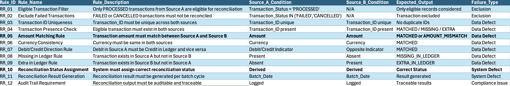

# Data Reconciliation QA Project

## Overview
This project demonstrates end-to-end data reconciliation testing using sample enterprise transaction data.
It simulates real-world scenarios where transactions from a source system are validated against a ledger system
to ensure data completeness, accuracy, and consistency.

The project covers the complete QA lifecycle including requirement analysis, reconciliation rule definition,
test case design, execution, defect reporting, and requirements traceability (RTM).

> ⚠️ Note: This is a sample project created for learning and demonstration purposes only.

---

## Business Scenario
In financial systems, transactions captured in operational systems must be accurately reflected in ledger systems.
Any mismatch can lead to financial reporting issues and regulatory risk.

This project validates:
- Missing transactions
- Extra ledger entries
- Amount mismatches
- Transaction status exclusions (FAILED / CANCELLED)

---

## Project Scope
- Source A: Transaction source system (operational data)
- Source B: Ledger system (financial postings)
- Reconciliation performed based on defined business rules
- Manual execution with analytical validation

---

## Reconciliation Rules
- Only SUCCESS transactions are eligible for reconciliation
- FAILED and CANCELLED transactions are excluded
- Transaction ID must match across sources
- Amount must match exactly
- Debit/Credit indicators must align

---

## Test Artifacts
- Requirements Document
- Reconciliation Rules
- Test Cases
- Test Data
- Reconciliation Results
- Defect Log
- RTM (Requirements Traceability Matrix)

All artifacts are maintained using Excel for traceability and transparency.

---

## Sample Screenshots

### Requirements & RTM

### Reconciliation Rules

### Test Cases

### Reconciliation Results

### Defect Log

---

## Tools & Skills Demonstrated
- Data Testing & Reconciliation
- Requirement Analysis & RTM
- Excel-based Test Case Design and Defect Reporting
- Python (Pandas) for Data Analysis
- AI-assisted Data Generation and Analysis

---

## Repository Structure
requirements/
testdata/
diagrams/
screenshots/
python_analysis/

---

## Key Learnings
- Importance of business rules in reconciliation
- Handling non-financial transactions
- Data quality validation techniques
- End-to-end QA traceability
